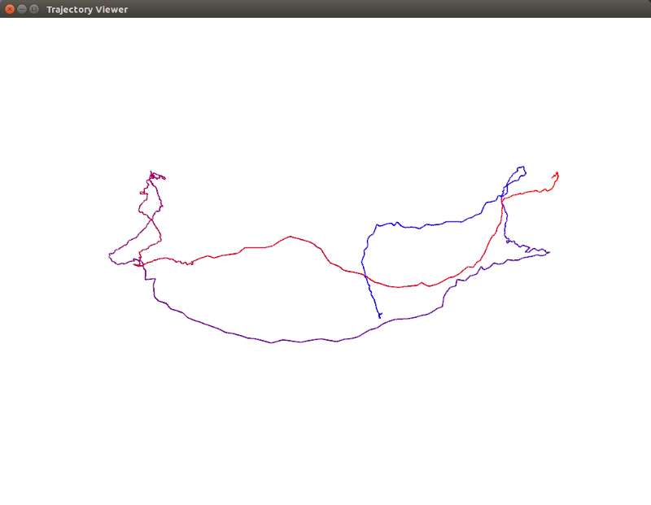
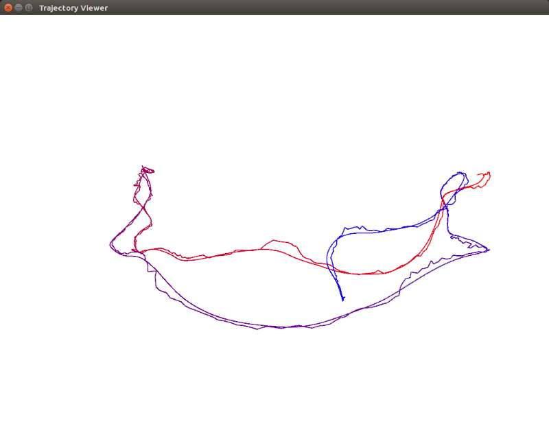
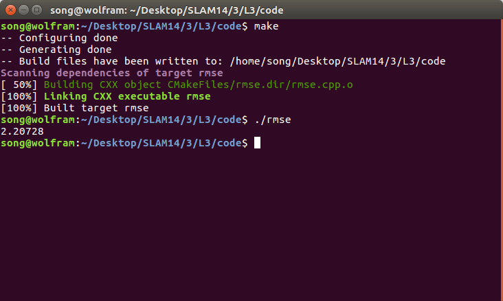

# 深蓝学院-SLAM第3课作业

# 验证向量叉乘的李代数性质

$[x,y]=x\times y$

## 1. 封闭性

$\forall x, y \in R^3$ , $x,y$ 属于 $3\times 1$ 维的向量空间 

$x \times y=x^\land y = A_{3\times 3} y_{3\times 1}, A $是x组成的反对称矩阵 ，矩阵乘法可知 $x\times y$ 也属于 $3\times 1$ 维的向量空间 

$[X,Y]\in R^3 $

封闭性得证

## 2. 双线性

由于叉乘的分配律

$(aX+bY)\times Z= aX\times Z+bY\times Z$

$Z\times (aX+bY)=aZ\times X+bZ\times Y$

双线性得证

## 3. 自反性

$A\times A=0$

自反性得证

## 4. 雅可比等价  

$x\times (y\times z)=(x\cdot z)\cdot y-(x\cdot y)\cdot z$

推出$x\times (y\times z)+z\times (x\times y)+y\times (z\times x)$

$=(x\cdot z)\cdot y-(x\cdot y)\cdot z+(z\cdot y)\cdot x-(z\cdot x)\cdot y+(y\cdot x)\cdot z-(y\cdot z)\cdot x$

$=0$

综上，$g=(R^3,R,\times)$ 构成李代数

# 推导 $SE(3)$ 的指数映射

$\xi=(\rho ,\phi) \in se(3)$

$\exp(\xi^\wedge)=exp(\begin{bmatrix} \xi^\wedge &\rho \\ 0& 0 \end{bmatrix})$

$=I+\begin{bmatrix} \xi^\wedge &\rho \\ 0& 0 \end{bmatrix}+\frac{1}{2!}\begin{bmatrix} (\xi^\wedge)^2 &\xi ^\wedge \rho \\ 0& 0 \end{bmatrix}+\frac{1}{3!}\begin{bmatrix}( \xi^\wedge)^3 &(\xi^\wedge)^2\rho \\ 0& 0 \end{bmatrix}+\cdots$

$=\begin{bmatrix} \exp(\xi^\wedge) &J\rho \\ 0& 1 \end{bmatrix}$


$J=I+\frac{1}{2!}\xi^\wedge +\frac{1}{3!}(\xi^\wedge)^2+\cdots$

$=I+(\Sigma_{i=0}^\infty \frac{(-1)^i \theta^{2i}}{(2i+2)!})\xi ^\wedge +(\Sigma_{i=0}^\infty \frac{(-1)^i \theta^{2i}}{(2i+3)!})(\xi ^\wedge)^2$

$=I+(\frac{1}{2!}-\frac{\theta^2}{4!}+\frac{\theta^4}{6!}+\cdots)\xi^\wedge+(\frac{1}{3!}-\frac{\theta^2}{5!}+\frac{\theta^4}{7!}+\cdots)(\xi^\wedge)^2$

$=I+(\frac{1-\cos\theta}{\theta^2})\xi^\wedge+(\frac{\theta-\sin\theta}{\theta^3})(\xi^\wedge)^2$


# 伴随 Adjoint

## $SO(3)$


$R \exp (p^\wedge)R^T=\exp((R p)^\wedge)$

此时称 $Ad(R)=R$


首先要证明 

$\forall a \in R^3, Ra^\wedge R^T =(Ra)^\wedge$

$(\mathbf R \boldsymbol a)^\wedge \mathbf v = (\mathbf R \boldsymbol   a) \times \mathbf v = (\mathbf R \boldsymbol  a) \times (\mathbf R \mathbf R^{-1}\mathbf v) = \mathbf R \left[\boldsymbol  a \times (\mathbf R^{-1} \mathbf v)\right] = \mathbf R \boldsymbol  a^\wedge \mathbf R^{-1} \mathbf v$


则

$R \exp (p^\wedge)R^T=\exp((R p)^\wedge)$

$\exp(p^\wedge)=R\exp((Rp)^\wedge)R^{-1}$

$\exp(Ad(R)p^\wedge)=R\exp(p^\wedge)R^{-1}$

$Ad(R)p^\wedge=R(\Sigma_{i=1}^3 p_i G_i)R^{-1} $

$= R p^\wedge R^{-1}$

$=(Rp)^\wedge$

$Ad(R)=R$


## $SE(3)$

$T\exp(\xi^\wedge)T^{-1}=\exp((Ad(T)\xi)^\wedge)$

$Ad(T)=\begin{bmatrix} R & t^\wedge R \\ 0 & R \end{bmatrix}$

# 轨迹的描述

物体的平移部分表示物体在坐标轴中的位置，旋转部分表示在这个点的姿态，有了平移部分就能知道在坐标轴中的移动，就是轨迹。


```cpp
int main(int argc, char **argv) {
    vector<Sophus::SE3> poses;
    /// implement pose reading code
    // start your code here (5~10 lines)
    ifstream fin(trajectory_file);
    for ( int i=0; i<620; i++ )
    {
        double data[8] = {0};
        for ( auto& d:data )
            fin>>d;
        Eigen::Quaterniond q( data[7], data[4], data[5], data[6] );
        Eigen::Vector3d t(data[1], data[2], data[3]);
        Sophus::SE3 SE3_qt(q,t);
        poses.push_back(SE3_qt);
    }
    // end your code here
    // draw trajectory in pangolin
    DrawTrajectory(poses);
    return 0;
}
```

```
cmake_minimum_required( VERSION 2.8 )
project( trajectory )

set( CMAKE_BUILD_TYPE Release )
set( CMAKE_CXX_FLAGS "-std=c++11 -O3" )
set(Sophus_LIBRARIES /home/song/Desktop/SLAM14/slambook/3rdparty/Sophus/build/libSophus.so)
# opencv 
find_package( OpenCV REQUIRED )
include_directories( ${OpenCV_INCLUDE_DIRS} )
# sophus
include_directories( /home/song/Desktop/SLAM14/slambook/3rdparty/Sophus )

# sophus 
find_package( Pangolin REQUIRED )
include_directories( ${Pangolin_INCLUDE_DIRS} )
# eigen 
include_directories( "/usr/include/eigen3/" )

add_executable( trajectory draw_trajectory.cpp )
target_link_libraries( trajectory ${OpenCV_LIBS} ${Sophus_LIBRARIES}  ${Pangolin_LIBRARIES}    )

# for the second task
add_executable( rmse rmse.cpp )
target_link_libraries( rmse ${OpenCV_LIBS} ${Sophus_LIBRARIES}  ${Pangolin_LIBRARIES}    )
```




# 轨迹的误差

```cpp
double RMSE(vector<Sophus::SE3> estimated_poses,vector<Sophus::SE3> groundtruth_poses)
{
    double sum = 0;
    for(int i=0;i<estimated_poses.size();i++)
    {
        double error = 0;
        double e = sqrt(  (groundtruth_poses.at(i).inverse() * estimated_poses.at(i)).log().transpose() *   (groundtruth_poses.at(i).inverse() * estimated_poses.at(i)).log()   );


        error = pow(abs(e),2);
        sum+= error;
    }
    double rmse = pow(sum/estimated_poses.size(),0.5);
    return rmse;
}
```






2.20728