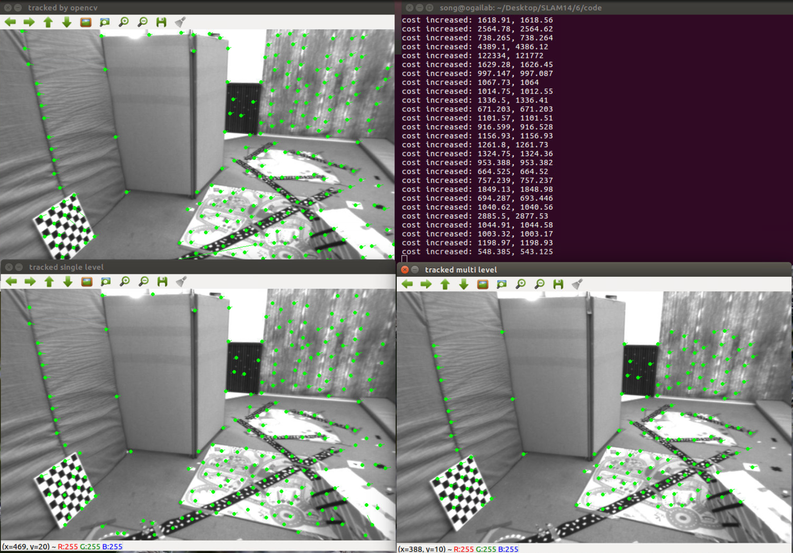
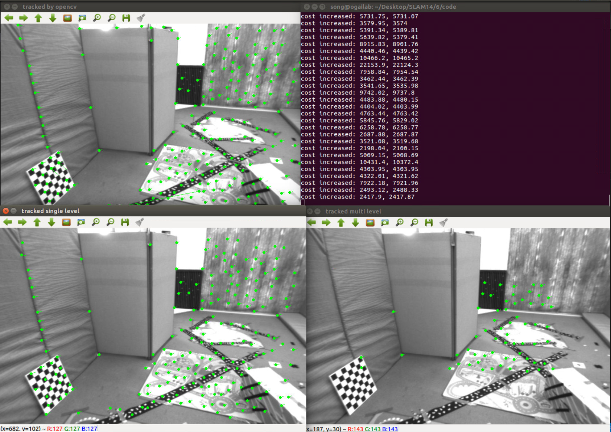
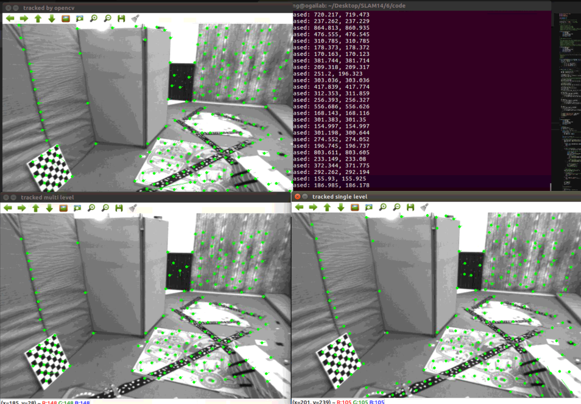
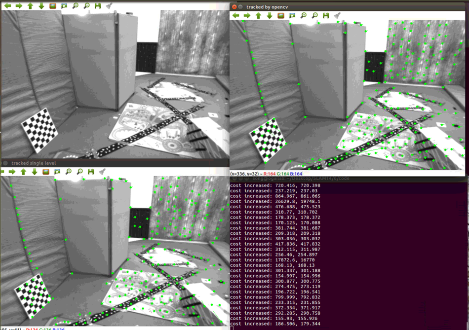
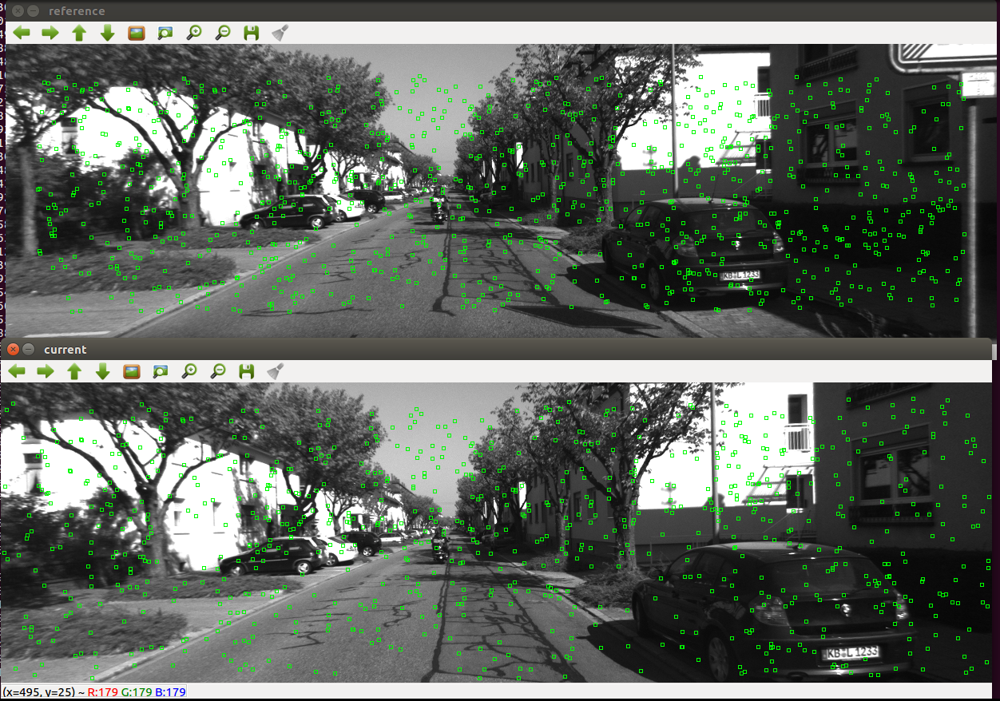
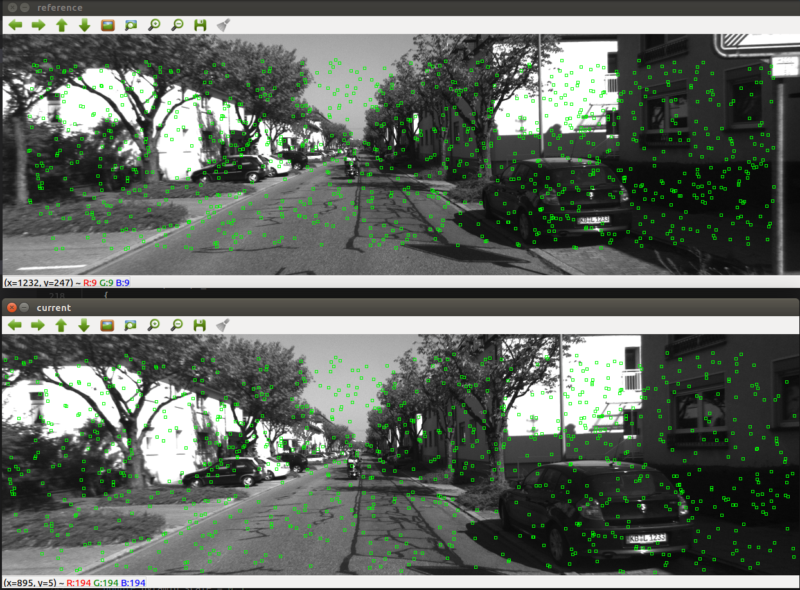
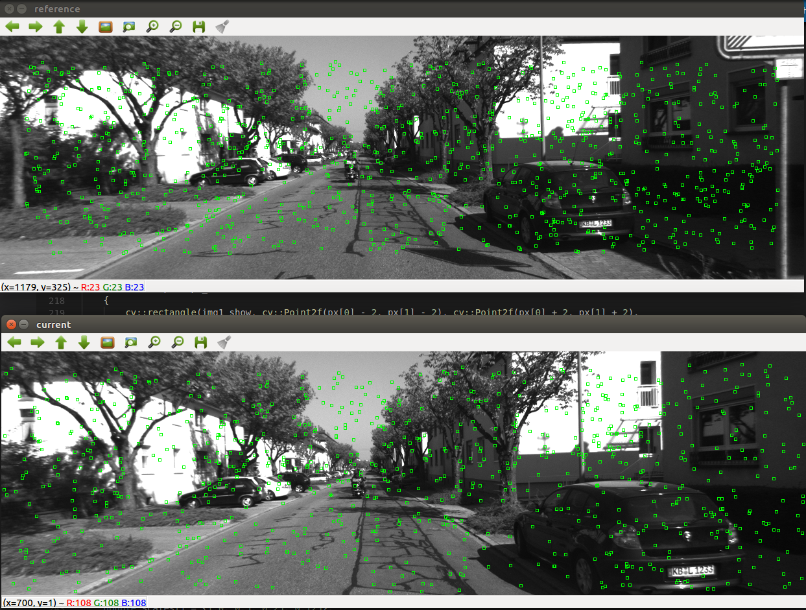
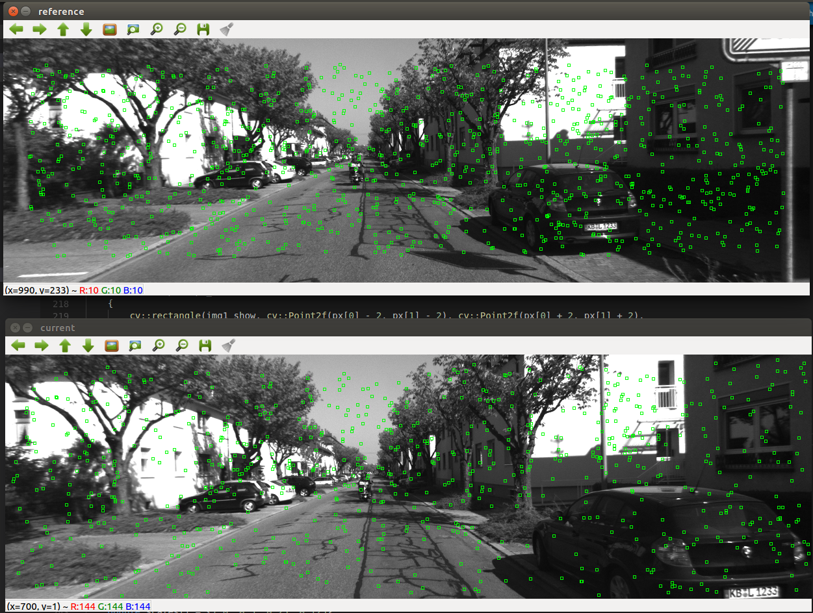
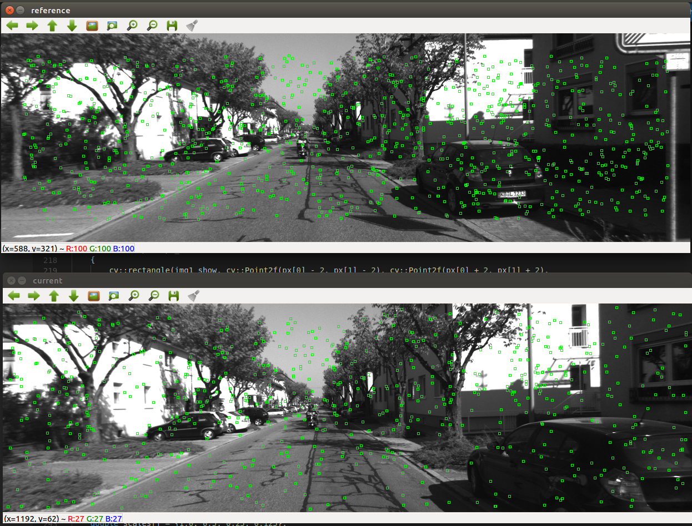

# 深蓝学院-SLAM第6课作业
# 1.LK 光流

## 1.1 光流文献综述

### 光流法分类

根据参数更新的方法分为：additive 和 compositional approach

根据参数估计的方向分为：forwards 和 inverse approach

###  在 compositional 中，为什么有时候需要做原始图像的 wrap？该 wrap 有何物理意义？ 

 re-parameterize the warps to ensure that $W(x;0) = x$ 

###  forward 和 inverse 有何差别？

参数估计的方向不同


## 1.2 forward-addtive Gauss-Newton 光流的实现

### 像素的误差

两像素的差值

```
double error = (GetPixelValue(img1,x1,y1)-GetPixelValue(img2,x1+dx,y1+dy));
```

### 误差相对于自变量的导数如何定义

```cpp
 // Forward Jacobian
J[0] = (GetPixelValue(img2,x1+dx+1,y1+dy) - GetPixelValue(img2,x1+dx-1,y1+dy))/2;
J[1] = (GetPixelValue(img2,x1+dx,y1+dy+1) - GetPixelValue(img2,x1+dx,y1+dy-1))/2;
```


```cpp
void OpticalFlowSingleLevel(
        const Mat &img1,
        const Mat &img2,
        const vector<KeyPoint> &kp1,
        vector<KeyPoint> &kp2,
        vector<bool> &success,
        bool inverse
) {

    // parameters
    int half_patch_size = 4;
    int iterations = 10;
    bool have_initial = !kp2.empty();

    for (size_t i = 0; i < kp1.size(); i++) {
        auto kp = kp1[i];
        double dx = 0, dy = 0; // dx,dy need to be estimated
        if (have_initial) {
            dx = kp2[i].pt.x - kp.pt.x;
            dy = kp2[i].pt.y - kp.pt.y;
        }

        double cost = 0, lastCost = 0;
        bool succ = true; // indicate if this point succeeded

        // Gauss-Newton iterations
        for (int iter = 0; iter < iterations; iter++) {
            Eigen::Matrix2d H = Eigen::Matrix2d::Zero();
            Eigen::Vector2d b = Eigen::Vector2d::Zero();
            cost = 0;

            if (kp.pt.x + dx <= half_patch_size || kp.pt.x + dx >= img1.cols - half_patch_size ||
                kp.pt.y + dy <= half_patch_size || kp.pt.y + dy >= img1.rows - half_patch_size) {   // go outside
                succ = false;
                break;
            }

            // compute cost and jacobian
            for (int x = -half_patch_size; x < half_patch_size; x++)
                for (int y = -half_patch_size; y < half_patch_size; y++) {

                    // TODO START YOUR CODE HERE (~8 lines)
                    float x1 = kp.pt.x + x;
                    float y1 = kp.pt.y + y;
                    double error = (GetPixelValue(img1,x1,y1)-GetPixelValue(img2,x1+dx,y1+dy));
                    Eigen::Vector2d J;  // Jacobian
                    if (inverse == false) {
                        
                        J[0] = (GetPixelValue(img2,x1+dx+1,y1+dy) - GetPixelValue(img2,x1+dx-1,y1+dy))/2;
                        J[1] = (GetPixelValue(img2,x1+dx,y1+dy+1) - GetPixelValue(img2,x1+dx,y1+dy-1))/2;
                    } else {
                        
                        J[0] = (GetPixelValue(img1,x1+1,y1) - GetPixelValue(img1,x1-1,y1))/2;
                        J[1] = (GetPixelValue(img1,x1,y1+1) - GetPixelValue(img1,x1,y1-1))/2;
                    }

                    // compute H, b and set cost;
                    H += J * J.transpose();
                    b += J.transpose() * error;
                    cost += error * error;
                    // TODO END YOUR CODE HERE
                }

            // compute update
            // TODO START YOUR CODE HERE (~1 lines)
            Eigen::Vector2d update = H.inverse() * b;
            // TODO END YOUR CODE HERE

            if (isnan(update[0])) {
                // sometimes occurred when we have a black or white patch and H is irreversible
                cout << "update is nan" << endl;
                succ = false;
                break;
            }
            if (iter > 0 && cost > lastCost) {
                cout << "cost increased: " << cost << ", " << lastCost << endl;
                break;
            }

            // update dx, dy
            dx += update[0];
            dy += update[1];
            lastCost = cost;
            succ = true;
        }

        success.push_back(succ);

        // set kp2
        if (have_initial) {
            kp2[i].pt = kp.pt + Point2f(dx, dy);
        } else {
            KeyPoint tracked = kp;
            tracked.pt += cv::Point2f(dx, dy);
            kp2.push_back(tracked);
        }
    }
}

```

## 1.3 反向法

```cpp
Eigen::Vector2d J;  // Jacobian
                    if (inverse == false) {
                        // Forward Jacobian
                        J[0] = (GetPixelValue(img2,x1+dx+1,y1+dy) - GetPixelValue(img2,x1+dx-1,y1+dy))/2;
                        J[1] = (GetPixelValue(img2,x1+dx,y1+dy+1) - GetPixelValue(img2,x1+dx,y1+dy-1))/2;
                    } else {
                        // Inverse Jacobian
                        // NOTE this J does not change when dx, dy is updated, so we can store it and only compute error
                        J[0] = (GetPixelValue(img1,x1+1,y1) - GetPixelValue(img1,x1-1,y1))/2;
                        J[1] = (GetPixelValue(img1,x1,y1+1) - GetPixelValue(img1,x1,y1-1))/2;
                    }
                   
```

## 1.4 推广至金字塔

###  所谓 coarse-to-fine 是指怎样的过程？ 

对图像进行降采样，建立多层图像金字塔，从最小的图像到原分辨率图像开始进行匹配。

### 光流法中的⾦字塔⽤途和特征点法中的⾦字塔有何差别？ 

光流法的金字塔：解决图像像素的非凸性，便于找到极值解。

特征点法的金字塔：解决特征点的尺度问题。


```cpp

void OpticalFlowMultiLevel(
        const Mat &img1,
        const Mat &img2,
        const vector<KeyPoint> &kp1,
        vector<KeyPoint> &kp2,
        vector<bool> &success,
        bool inverse) {

    // parameters
    int pyramids = 4;
    double pyramid_scale = 0.5;
    double scales[] = {1.0, 0.5, 0.25, 0.125};

    // create pyramids
    vector<Mat> pyr1, pyr2; // image pyramids
    // TODO START YOUR CODE HERE (~8 lines)
    for (int i = 0; i < pyramids; i++) {
        Mat dst1;
        Mat dst2;
        resize(img1, dst1, Size(), scales[i], scales[i]);
        resize(img2, dst2, Size(), scales[i], scales[i]);
        pyr1.push_back(dst1.clone());
        pyr2.push_back(dst2.clone());
    }

    // TODO END YOUR CODE HERE

    // coarse-to-fine LK tracking in pyramids
    // TODO START YOUR CODE HERE

    vector<KeyPoint> kp2_scale;
    for(int i = pyramids - 1; i >= 0; --i)
    {
        vector<KeyPoint> kp1_scale = kp1;
        for(int j = 0; j != kp1_scale.size(); ++j)
        {
            kp1_scale[j].pt.x *= scales[i];
            kp1_scale[j].pt.y *= scales[i];
        }

        for(int j = 0; j != kp2_scale.size(); ++j)
        {
            kp2_scale[j].pt.x *= scales[i];
            kp2_scale[j].pt.y *= scales[i];
        }

        OpticalFlowSingleLevel(pyr1[i], pyr2[i], kp1_scale, kp2_scale, success, inverse);

        for(int j = 0; j != kp2_scale.size(); ++j)
        {
            kp2_scale[j].pt.x /= scales[i];
            kp2_scale[j].pt.y /= scales[i];
        }
    }

    kp2 = kp2_scale;
    // TODO END YOUR CODE HERE
    // don't forget to set the results into kp2
}
```


前向的单层和多层金字塔（opencv / terminal / singlelayer / multilayer）


后向的单层和多层金字塔（opencv / terminal / singlelayer / multilayer）


## 讨论

### 我们优化两个图像块的灰度之差真的合理吗？哪些时候不够合理？你有解决办法吗？ 

灰度差能够比较合理的表示出translation， 但不太容易描述rotation。

灰度不变是个强假设，成立的条件比较苛刻，实际运用时不太稳定。

不同帧时的灰度容易受到曝光影响，可以对每帧进行参数调整。

### 图像块⼤⼩是否有明显差异？取 16x16 和 8x8 的图像块会让结果发⽣变化吗？ 

patch=8



patch = 16



patch较大的时候，误差绝对值变大，得调整阈值，否则会丢失，并且cost function下降的时间变长。

patch较大的时候单层效果较好，多层容易丢失（因为阈值没变）。


### 金字塔层数对结果有怎样的影响？缩放倍率呢?

金字塔层数多时效果更好。

level=10



缩放倍率=0.25

多层容易丢失。单层效果较好。




# 2. 直接法

## 2.1 单层直接法

### 该问题中的误差项是什么？ 

两个patch内像素值的差

```cpp
double error = GetPixelValue(img1, px_refi + x, px_refi + y) - GetPixelValue(img2, p2[0] + x, p2[1] + y);
```


### 误差相对于⾃变量的雅可⽐维度是多少？如何求解？ 

```cpp
Matrix26d J_pixel_xi; // pixel to \xi in Lie algebra
J_pixel_xi << fx / Z, 0, -fx * X / Z2, -fx * X * Y / Z2, fx + fx * X * X / Z2, -fx * Y / Z,
0, fy / Z, -fy * Y / Z2, -fy - fy * Y * Y / Z2, fy * X * Y / Z2, fy * X / Z;
```


### 窗⼜可以取多⼤？是否可以取单个点？ 

窗口取太大误差会增大，因为搜索范围变大，迭代的时候容易陷入局部最优。

当然不能取单个点，这样的估计结果不稳定。

```cpp

void DirectPoseEstimationSingleLayer(
    const cv::Mat &img1,
    const cv::Mat &img2,
    const VecVector2d &px_ref,
    const vector<double> depth_ref,
    Sophus::SE3 &T21)
{

    // parameters
    int half_patch_size = 4;
    int iterations = 100;

    double cost = 0, lastCost = 0;
    int nGood = 0; // good projections
    VecVector2d goodProjection;

    for (int iter = 0; iter < iterations; iter++)
    {
        nGood = 0;
        goodProjection.clear();

        // Define Hessian and bias
        Matrix6d H = Matrix6d::Zero(); // 6x6 Hessian
        Vector6d b = Vector6d::Zero(); // 6x1 bias

        for (size_t i = 0; i < px_ref.size(); i++)
        {

            // compute the projection in the second image
            // TODO START YOUR CODE HERE
            float u = 0, v = 0;

            Eigen::Vector3d p1((px_ref[i][0] - cx) / fx * depth_ref[i], (px_ref[i][1] - cy) / fy * depth_ref[i], depth_ref[i]);
            Eigen::Vector3d p_2 = T21 * p1;
            Eigen::Vector2d p2(fx * p_2[0] / p_2[2] + cx, fy * p_2[1] / p_2[2] + cy);

            u = p2[0];
            v = p2[1];

            if (u < half_patch_size || u > img2.cols - half_patch_size || v < half_patch_size || v > img2.rows - half_patch_size)
            {
                continue;
            }

            nGood++;
            Eigen::Vector2d goodPoint(u, v);
            goodProjection.push_back(goodPoint);

            // and compute error and jacobian
            for (int x = -half_patch_size; x < half_patch_size; x++)
                for (int y = -half_patch_size; y < half_patch_size; y++)
                {

                    double error = GetPixelValue(img1, px_ref[i][0] + x, px_ref[i][1] + y) - GetPixelValue(img2, p2[0] + x, p2[1] + y);

                    double Z = depth_ref[i];
                    double X = (px_ref[i][0] + x - cx) / fx * Z;
                    double Y = (px_ref[i][1] + y - cy) / fy * Z;
                    double Z2 = Z * Z;

                    Matrix26d J_pixel_xi; // pixel to \xi in Lie algebra
                    J_pixel_xi << fx / Z, 0, -fx * X / Z2, -fx * X * Y / Z2, fx + fx * X * X / Z2, -fx * Y / Z,
                        0, fy / Z, -fy * Y / Z2, -fy - fy * Y * Y / Z2, fy * X * Y / Z2, fy * X / Z;

                    Eigen::Vector2d J_img_pixel((GetPixelValue(img2, p2(0) + x + 1, p2(1) + y) - GetPixelValue(img2, p2(0) + x - 1, p2(1) + y)) / 2,
                                                (GetPixelValue(img2, p2(0) + x, p2(1) + y + 1) - GetPixelValue(img2, p2(0) + x, p2(1) + y - 1)) / 2); // image gradients

                    // total jacobian

                    Vector6d J = -J_img_pixel.transpose() * J_pixel_xi;

                    H += J * J.transpose();
                    b += -error * J;
                    cost += error * error;
                }
            // END YOUR CODE HERE
        }

        // solve update and put it into estimation
        // TODO START YOUR CODE HERE
        Vector6d update = H.ldlt().solve(b);
        T21 = Sophus::SE3::exp(update) * T21;
        // END YOUR CODE HERE

        cost /= nGood;

        if (isnan(update[0]))
        {
            // sometimes occurred when we have a black or white patch and H is irreversible
            cout << "update is nan" << endl;
            break;
        }
        if (iter > 0 && cost > lastCost)
        {
            cout << "cost increased: " << cost << ", " << lastCost << endl;
            break;
        }
        lastCost = cost;
        cout << "cost = " << cost << ", good = " << nGood << endl;
    }
    cout << "good projection: " << nGood << endl;
    cout << "T21 = \n"
         << T21.matrix() << endl;

    // in order to help you debug, we plot the projected pixels here
    cv::Mat img1_show, img2_show;
    cv::cvtColor(img1, img1_show, CV_GRAY2BGR);
    cv::cvtColor(img2, img2_show, CV_GRAY2BGR);
    for (auto &px : px_ref)
    {
        cv::rectangle(img1_show, cv::Point2f(px[0] - 2, px[1] - 2), cv::Point2f(px[0] + 2, px[1] + 2),
                      cv::Scalar(0, 250, 0));
    }
    for (auto &px : goodProjection)
    {
        cv::rectangle(img2_show, cv::Point2f(px[0] - 2, px[1] - 2), cv::Point2f(px[0] + 2, px[1] + 2),
                      cv::Scalar(0, 250, 0));
    }
    cv::imshow("reference", img1_show);
    cv::imshow("current", img2_show);
    cv::waitKey(5);
}

```

## 2.2 多层直接法
```cpp
void DirectPoseEstimationMultiLayer(
    const cv::Mat &img1,
    const cv::Mat &img2,
    const VecVector2d &px_ref,
    const vector<double> depth_ref,
    Sophus::SE3 &T21)
{

    // parameters
    int pyramids = 4;
    double pyramid_scale = 0.5;
    double scales[] = {1.0, 0.5, 0.25, 0.125};

    // create pyramids
    vector<cv::Mat> pyr1, pyr2; // image pyramids
    // TODO START YOUR CODE HERE
    for (int i = 0; i != pyramids; ++i)
    {
        cv::Mat dst1, dst2;

        cv::resize(img1, dst1, cv::Size(), scales[i], scales[i]);
        cv::resize(img2, dst2, cv::Size(), scales[i], scales[i]);

        pyr1.push_back(dst1.clone());
        pyr2.push_back(dst2.clone());
    }

    // END YOUR CODE HERE

    double fxG = fx, fyG = fy, cxG = cx, cyG = cy; // backup the old values
    for (int level = pyramids - 1; level >= 0; level--)
    {
        VecVector2d px_ref_pyr; // set the keypoints in this pyramid level
        for (auto &px : px_ref)
        {
            px_ref_pyr.push_back(scales[level] * px);
        }

        // TODO START YOUR CODE HERE
        // scale fx, fy, cx, cy in different pyramid levels
        cx = cxG * scales[level];
        cy = cyG * scales[level];
        //fx = fxG * scales[level];
        //fy = fyG * scales[level];
        // END YOUR CODE HERE
        DirectPoseEstimationSingleLayer(pyr1[level], pyr2[level], px_ref_pyr, depth_ref, T21);
    }
}

```


1.



2.



3.



4.




5.




## 2.3 延伸讨论


### 直接法是否可以类似光流，提出 inverse, compositional 的概念？它们有意义吗？ 

不需要，直接法的意义就是直接通过像素差来估计。

### 请思考上⾯算法哪些地⽅可以缓存或加速？ 

比较的patch可以缓存。

### 在上述过程中，我们实际假设了哪两个 patch 不变？ 

refenrence的patch和 和current中旋转后的patch灰度不变。

### 为何可以随机取点？⽽不⽤取⾓点或线上的点？那些不是⾓点的地⽅，投影算对了吗？ 

patch随机取，因为只需要灰度梯度，不需要特征点。

### 请总结直接法相对于特征点法的异同与优缺点。

特征点法：特征点具有旋转不变性，并且应对灰度变化鲁棒性较强。但计算量较大。特征点比较稀疏时容易丢失。除了提取和匹配耗时，在使用特征点时，也忽略了除特征点以外的所有信息，因此丢弃了很多可能有用的图像信息. 

直接法：比较稠密，计算量相对较小，快速旋转是很容易丢失，并cost function的非凸性对位姿的估计影响很大，容易陷入局部最优解。除了提取和匹配耗时，在使用特征点时，也忽略了除特征点以外的所有信息，因此丢弃了很多可能有用的图像信息. 

# 3 使用光流计算视差


```cpp

int main(int argc, char **argv) {

    // images, note they are CV_8UC1, not CV_8UC3
    Mat left_img = imread(left_file, 0);
    Mat right_img = imread(right_file, 0);
    Mat disparity_img = imread(disparity_file, 0);

    // key points, using GFTT here.
    vector<KeyPoint> kp1;
    Ptr<GFTTDetector> detector = GFTTDetector::create(500, 0.01, 20); // maximum 500 keypoints
    detector->detect(left_img, kp1);


    // then test multi-level LK
    vector<KeyPoint> kp2;
    vector<bool> success;
    //TODO
    OpticalFlowMultiLevel(left_img, right_img, kp1, kp2, success);

    Mat left_img_show = left_img;
    cv::cvtColor(left_img, left_img_show, CV_GRAY2BGR);
    for (int i = 0; i < kp1.size(); i++) {

        cv::circle(left_img_show, kp1[i].pt, 2, cv::Scalar(0, 250, 0), 2);


    }
    // plot the differences of those functions
    Mat right_img_show;
    cv::cvtColor(right_img, right_img_show, CV_GRAY2BGR);
    for (int i = 0; i < kp2.size(); i++) {
        if (success[i]) {
            if(kp1[i].pt == kp2[i].pt) cout<<"==="<<endl;
            cv::circle(right_img_show, kp2[i].pt, 2, cv::Scalar(0, 250, 0), 2);
            cv::line(right_img_show, kp1[i].pt, kp2[i].pt, cv::Scalar(0, 250, 0));
        }
    }


    Mat match_img;
    vector<cv::DMatch> matches;
    for (int k =0; k <kp1.size();k++)
    {
        if(success[k])
        {
            cv::DMatch m;
            m.queryIdx=k;
            m.trainIdx=k;
            double disparity_ref = double(disparity_img.at<uchar>(kp1[k].pt.y,kp1[k].pt.x ));
            m.distance= float(abs(fx*baseline/(kp2[k].pt.x - kp1[k].pt.x) - fx*baseline /disparity_ref) );
            matches.push_back(m);

        }
    }


    // plot the matches
    cv::imshow("right_img_show", right_img_show);
    cv::imwrite("right_img_show.png", right_img_show);

    cv::drawMatches(left_img, kp1, right_img, kp2, matches, match_img);
    cv::imshow("matches", match_img);
    cv::imwrite("matches.png", match_img);

    cv::waitKey(0);

    double error = 0;
    int count = 0 ;
    for(auto m  : matches)
    {
        error+= m.distance;
        count ++;
    }
    cout<<"error: "<< error<<endl;
    cout<<"average error: "<<error/count<<endl;

    return 0;
}

```


```
T10 = 
   0.999991  0.00242537  0.00337047 -0.00175972
-0.00243275    0.999995  0.00218665   0.0027037
-0.00336515 -0.00219483    0.999992   -0.725112
          0           0           0           1


T20 = 
   0.999973   0.0013812  0.00728271  0.00751169
-0.00140943    0.999992  0.00387181 -0.00105846
 -0.0072773 -0.00388197    0.999966    -1.47007
          0           0           0           1

T30 = 
   0.999937  0.00160735   0.0111135  0.00656047
 -0.0016638    0.999986  0.00507202  0.00422866
 -0.0111052 -0.00509019    0.999925    -2.20817
          0           0           0           1

T40 = 
    0.999872  0.000306235    0.0159716   0.00239527
-0.000397274     0.999984   0.00569717   0.00433555
  -0.0159696  -0.00570279     0.999856     -2.98799
           0            0            0            1

T50 = 
    0.999742  0.000358353    0.0227213    -0.249619
-0.000476198     0.999986   0.00518134    0.0348917
  -0.0227192  -0.00519083     0.999728     -3.45315
           0            0            0            1

```


